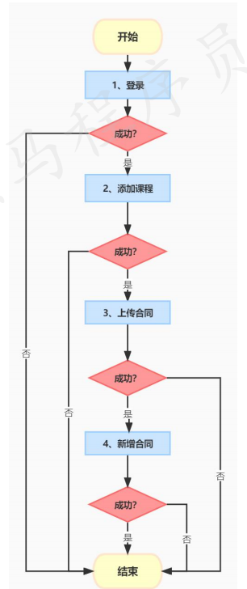
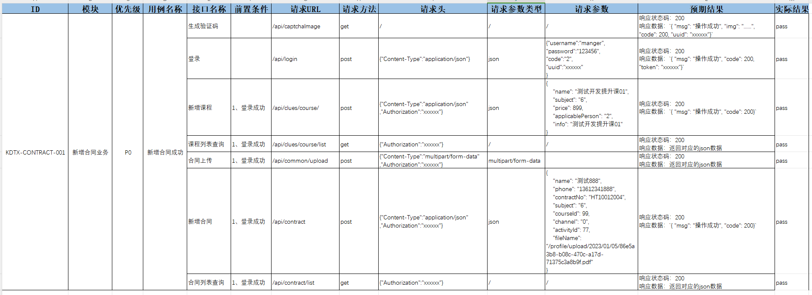
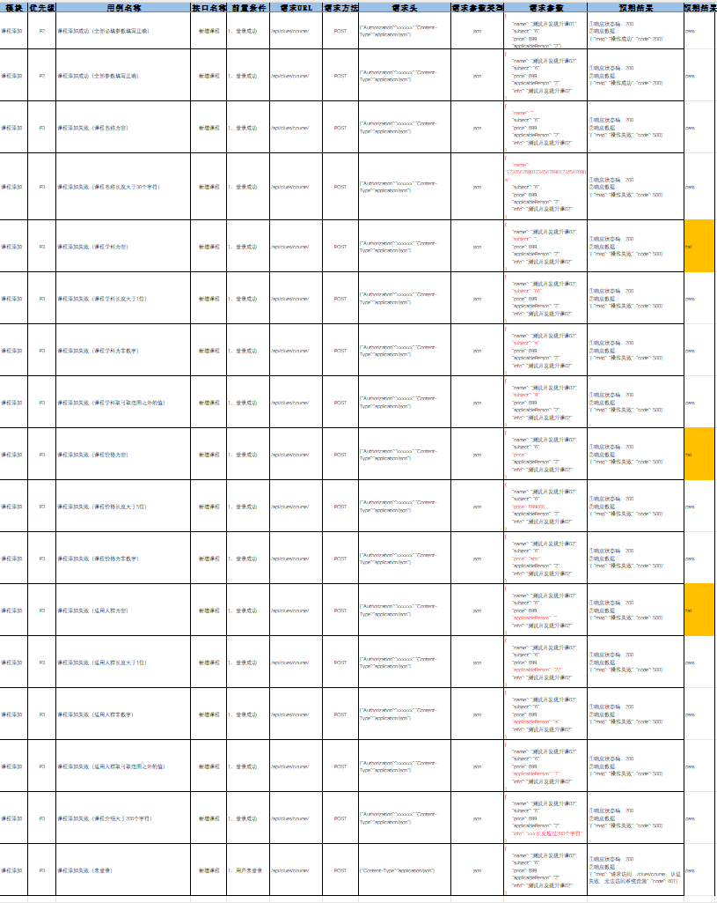
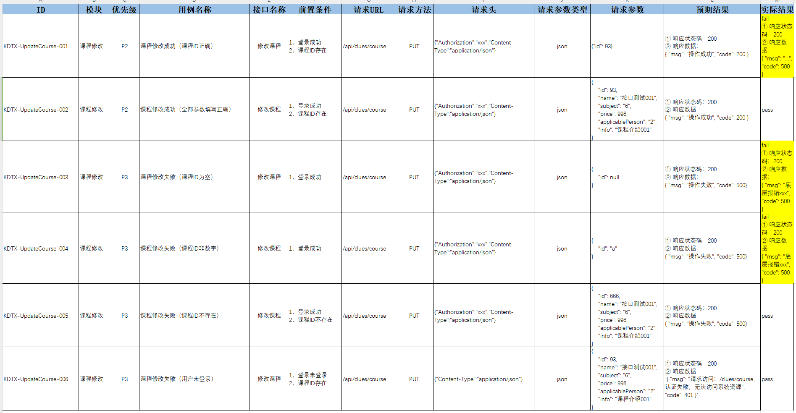
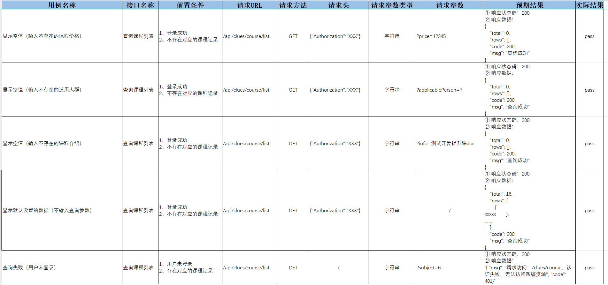
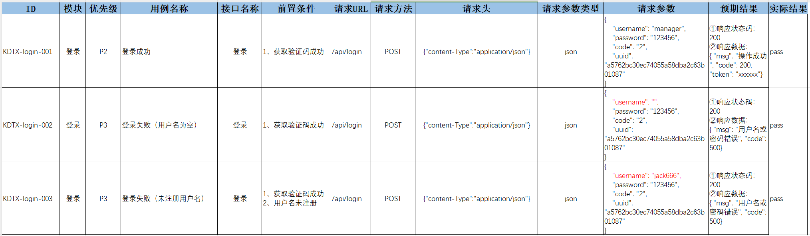

# 汇客 CRM 项目的 API 自动化测试框架

> 汇客 CRM 项目源代码地址：https://github.com/Lamb-xy/huike

## 项目目录结构

huike-apitest # 项目名称

├── api # 定义封装被测系统的接口

├── script # 定义测试用例脚本

├── data # 存放测试数据文件

├── report # 存放生成的测试报告

├── common # 存放通用工具类

├── config.py # 定义项目的配置信息

└── pytest.ini # pytest配置文件

## 已完成模块及测试用例截图

### 合同新增业务

登录 - 添加课程 - 上传合同 - 新增合同

业务流程测试用例

### 课程管理模块

- 添加课程

  

  

- 修改课程

  

- 查询课程

  

- 删除课程

  

### 登录接口-单接口测试用例

